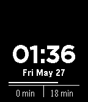

# wf
A little experiment to develop a watchface for my Pebble Time Steel.

The crucial innovation included in this watchface is two indicators at the bottom with times to travel to two configured locations, using the Google Maps Distance Matrix API. I use this to determine the distance to both my home, and work. This updates every six minutes at present.

These can be updated on the configuration page.

Provided with absolutely no warranty. May melt your cat, short your stock, lose your house in a poker match. You've been warned.

